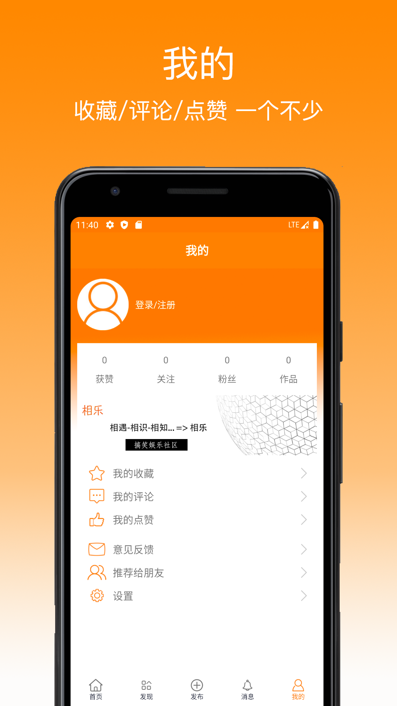

# 相乐搞笑(xiangle-android)
之前分享了 [xiangle-ios](https://github.com/chudaozhe/xiangle-ios/) ，现把Android版也分享出来

# 项目介绍
```text
主框架: TabLayout+ViewPager
子页面: 所有子页面共用一个Activity,具体实现集中在Fragment
网络请求: retrofit2+rxjava3
图片加载: glide
列表加载: RecyclerView或ListView
文件存储: OSS(sts方式)
下拉刷新，上拉加载: SmartRefreshLayout
token存储: SharedPreferences

目录结构
adapter: 所有RecyclerView或ListView的适配器
bean: 主要是网络请求返回数据的实体
fragment: 子页面的fragment
listener: 两个监听器，列表(list)和详情(detail)（以接口返回的数据来区分）；每个监听器定义两个方法：onSuccess，onError；有网络请求的fragment需实现list/detail监听器
model: 所有接口的model
service: 所有接口的定义，定义完给model使用
utility: 工具类，如屏幕信息，app信息，retrofit，oss等
view: 自定义view，如九宫格，圆形头像，弹窗（DialogFragment）
```

# 介绍
分享风趣幽默的段子/视频/图片
```text
首页：视频/图片/文字 任你选择
详情：收藏/评论/点赞 雁过留声
发现：搜索/话题/活动 应有尽有
我的：收藏/评论/点赞 一个不少
```

# 截图




# 快速开始

1.使用Android Studio打开

# 已打包的版本
[下载链接](https://xiangle.cuiwei.net/download/)
